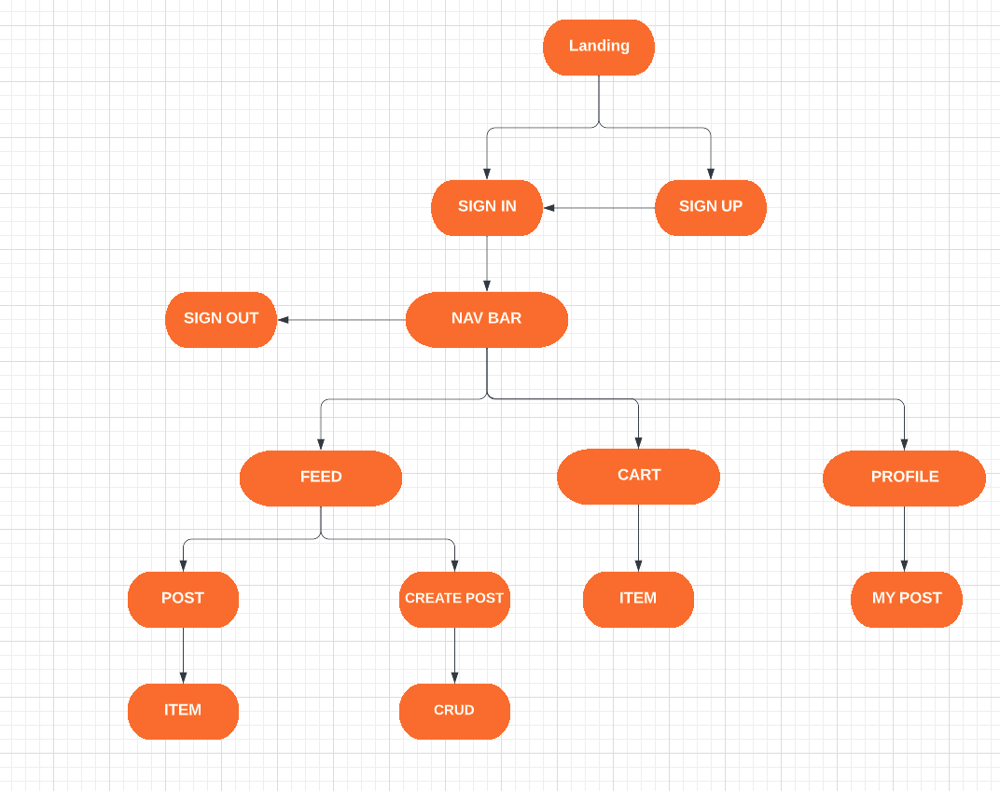
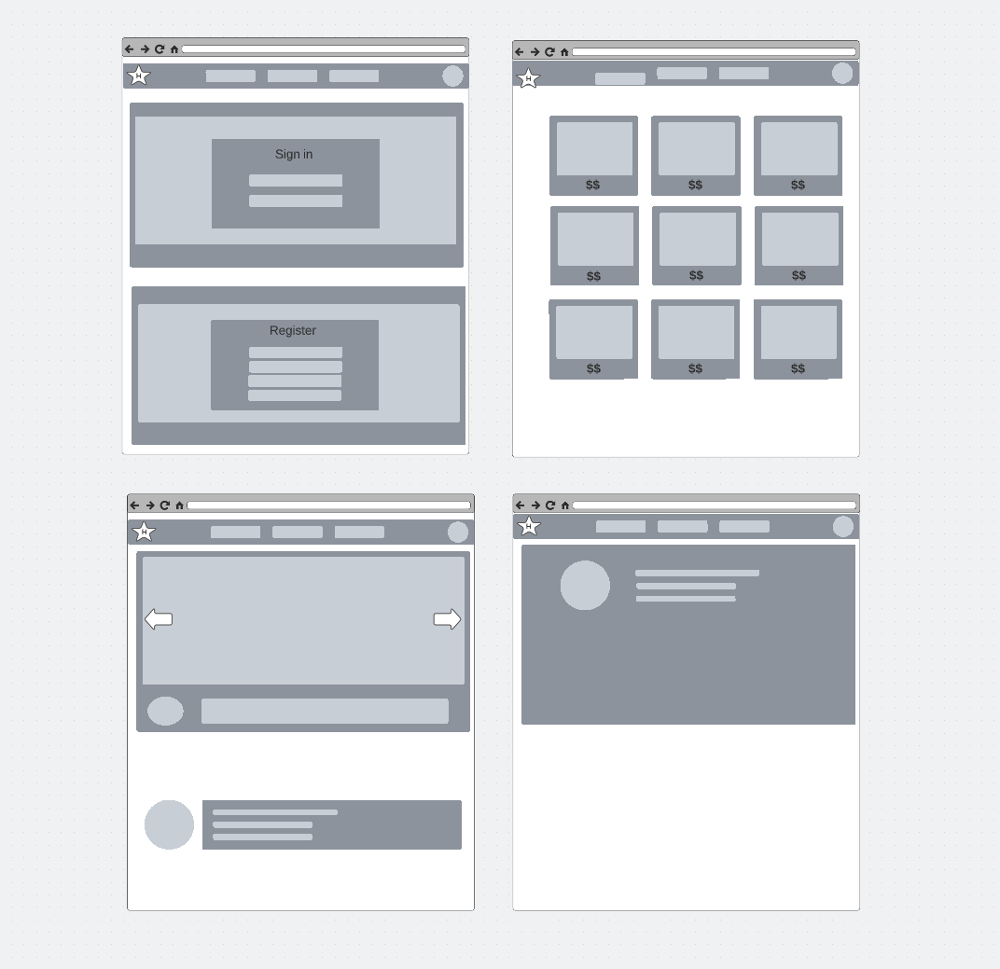
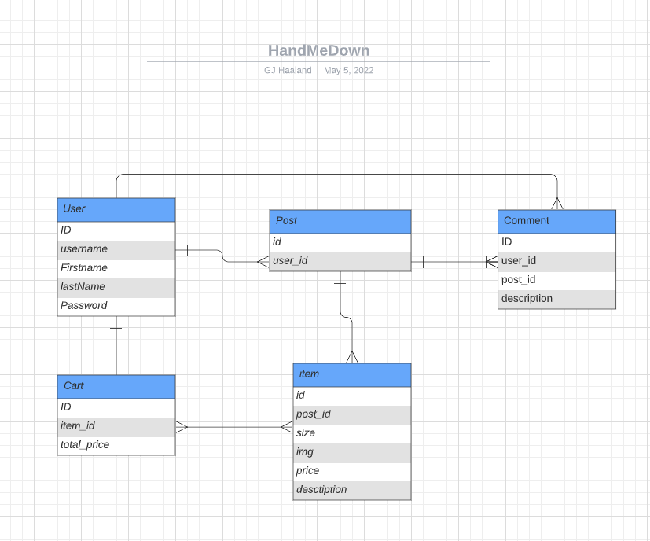

<h1 align="center">
 HandMeDown 
</h1>

  The Capstone Project of GA SEI Cohort built with <a href="https://reactjs.org/" target="_blank">React</a>, <a href="https://www.postgresql.org/" target="_blank">PostgreSQL</a> By GJ Haaland

  Follow me:
  <a href="https://www.linkedin.com/in/gj-haaland-b3b131b7/" target="_blank">LinkedIn</a>,
  <a href="https://github.com/GG-Haaland" target="_blank">Github</a>,
  <a href="https://www.instagram.com/gee_eej/" target="_blank">Instagram</a>

  
  

#### Capstone Project

---

#### GJ Haaland | [GITHUB](https://github.com/GG-Haaland) | [LINKEDIN](https://www.linkedin.com/in/gj-haaland-b3b131b7/)

## Technologies Used:

### Github, Trello, VS Code, React, PostgreSQL, Postico

---

## **_Summary_**

For my capstone project, I decided to create a place where you could not only buy but also sell/give away your children's handmedowns. Instead of buying new clothes when your kid grows out of them... buy a used set. Save some money and save the environment. Similar looking to Etsy users will have the ability to post an item they either want to sell or give away. They will have the ability to edit, update, and delete the post as well.

## **_Front End_**

I will build a fully functional React app with a landing page where you will be able to sign in or sign up if you are not already registered. Once past the log-in page you'll see your main feed where all posts will be visible. There will be a Navigation Bar with links to Feed, Your Profile, and Sign Out. 

## **_Back End_**

For my database i will use PostgreSql and it will consist of posts, comments, and users. You will have the ability to add a new user by registering and logging in with full CRUD on post and users.

---

## **_Resources_**

### - [Trello](https://trello.com/b/ItY6vv9L/handmedown)

### - [Github](https://github.com/GG-Haaland/Frontend)

